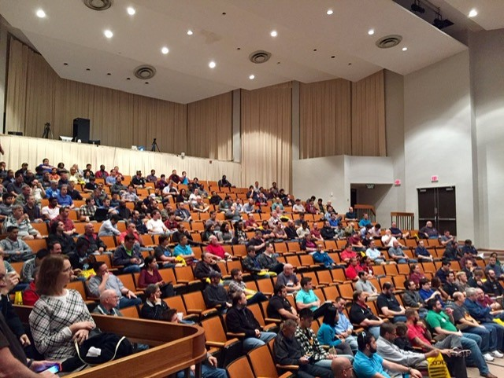

# Orlando Code Camp 2024

## February 24th 2024 from 7:30 AM to 5:00 PM

### Seminole State College, Sanford, FL

Orlando Code Camp is organized by the [Orlando .NET User Group (ONETUG)](https://onetug.net)
and hosted at the Sanford/Lake Mary campus of [Seminole State College](https://www.seminolestate.edu/slm).

[Sign up here to attend](https://www.eventbrite.com/e/orlando-code-camp-2024-tickets-800584980227)

The event entry is **FREE** to all attendees, thanks to our generous sponsors.

We will feature multiple tracks of hard core technical and tech industry-adjacent talks of 50 minutes each.

[Learn more about the event](/location)
[Check out the sponsors and sponsorship packages](/sponsors)
[See 70+ confirmed speakers](/speakers)
[Pick from 70+ confirmed sessions](/sessions)
[Find out about our community partners and local events](/partners)

{::comment}
[Learn more about the event and organizers](/about)
[Latest information for attendees](/attendees)
{:/comment}

---

Orlando Code Camp is generously sponsored by the following companies:

  {:class="logo-home-page-wide"}
  {:class="logo-home-page-wide"}
  {:class="logo-home-page-square"}
  {:class="logo-home-page-short-wide"}

---

Orlando Code Camp proudly partners with the following local organizations:

  {:class="logo-home-page-wide"}
  {:class="logo-home-page-square"}
   Central Florida"){:class="logo-home-page-short-wide"}
  {:class="logo-home-page-wide"}
  {:class="logo-home-page-wide"}
  {:class="logo-home-page-square"}

